**Docker & Docker Hub**

**Assignment 1**

1. docker version : Command used to check installed version of docker

    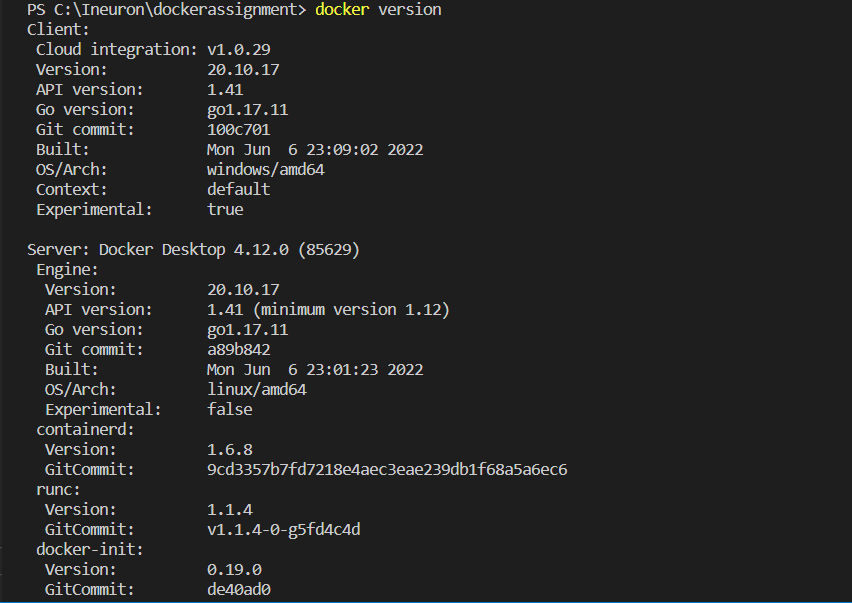

2. docker --help : Command used to see all the useful commands and options available with dockers.

    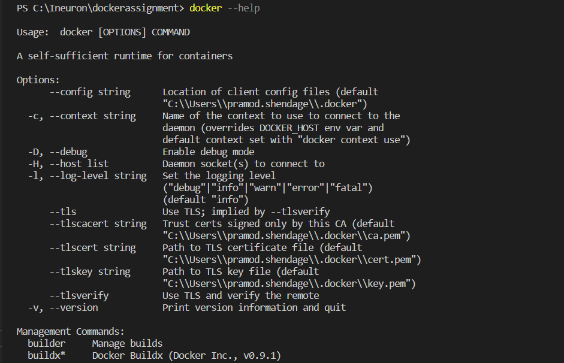

3. docker pull : Command used to pull an image from a registry

    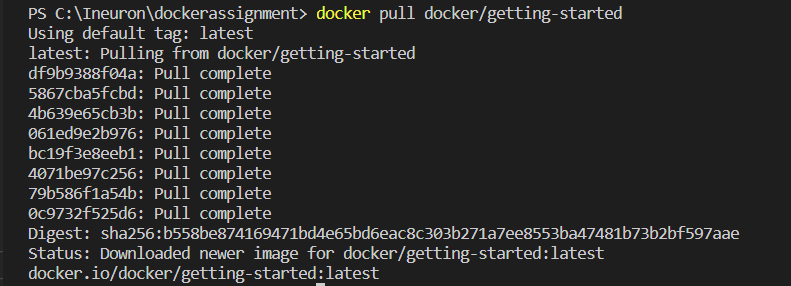

4. docker images : Command used to list docker images

    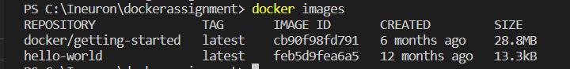

5. docker run : Command used to run the docker image
    -d -> detached mode
    -p -> port  
    80:80 -> (host port : container port)

    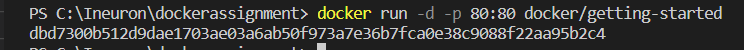

6. docker ps : Command used to list all the running docker images

    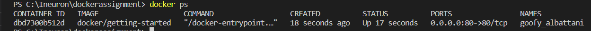

7. docker stop : Command used to stop running containers

    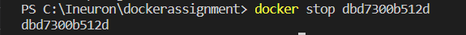

8. docker start : Command used to start the conatainer

    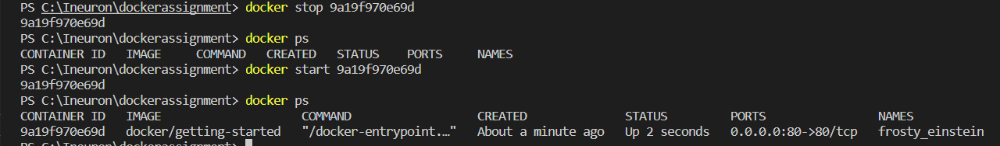

9. docker rm : Command used to remove containers
    -f : forcefully rmove container

    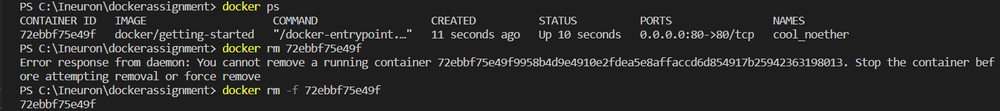

10. docker rmi : Command used to remove image
     
    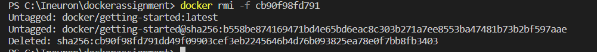

11. docker kill : Command used to kill running containers

    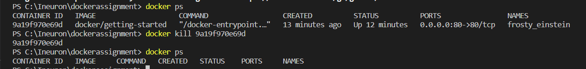

12. docker system df : Command used to check disc usage

    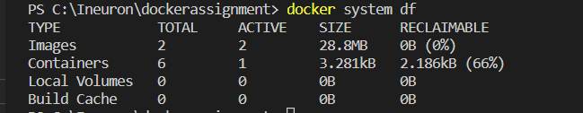

13. docker logs : Command used to fetch the logs of a container

    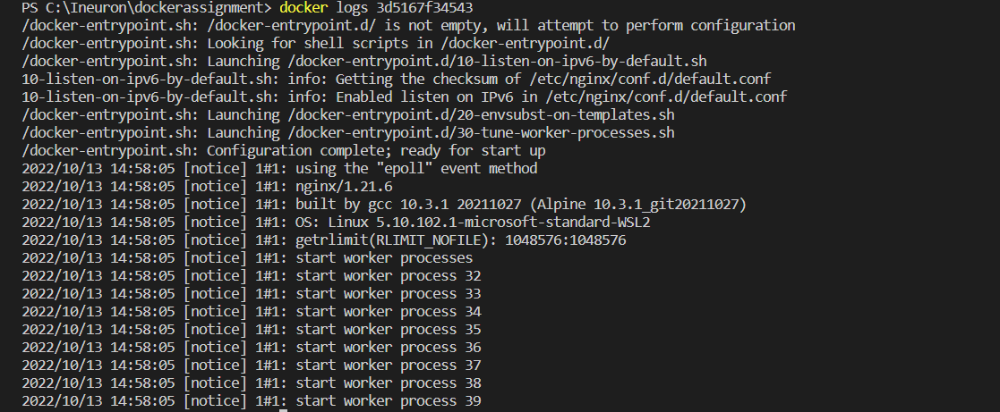

14. docker port : Command used to fetch the port information of container

    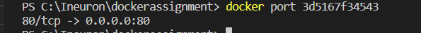

15. docker restart : Command used to restart the containers

    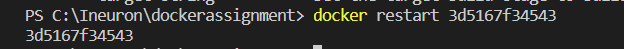

16. docker login : Command used to login into docker hub with username and password

    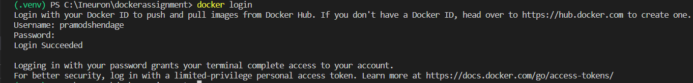

17. docker logout : Command used to logout from docker hub

    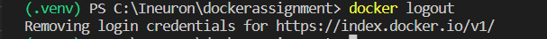

18. docker commit : Command used to commit docker image

    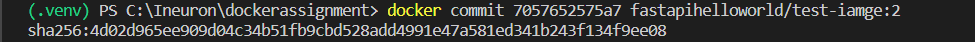

19. docker push : Command used to push docker image to docker hub

    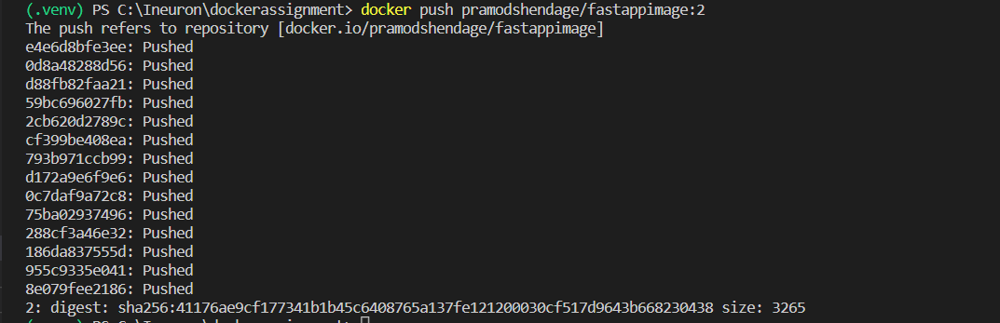

**Assignment 2**
    Run Hello World Docker Image Locally

    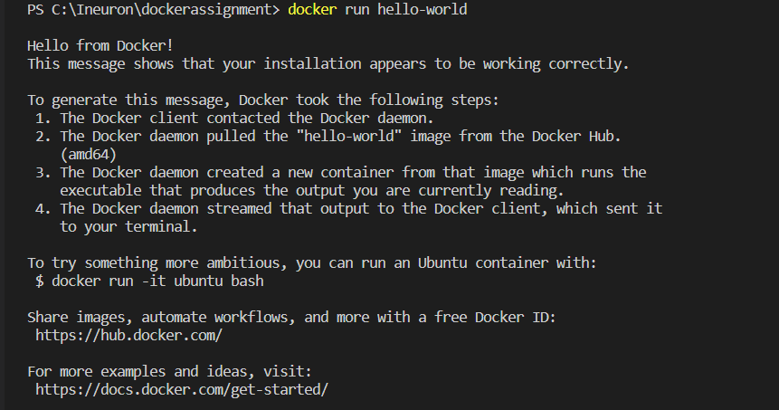

**Assignment 3**

    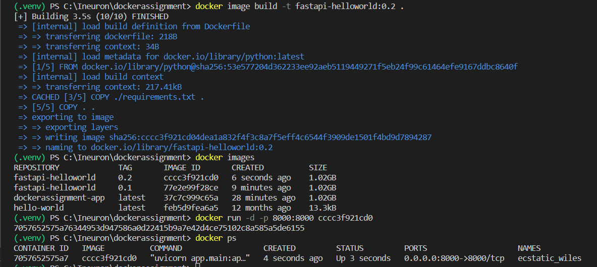

    Locally running fastapi helloworld

    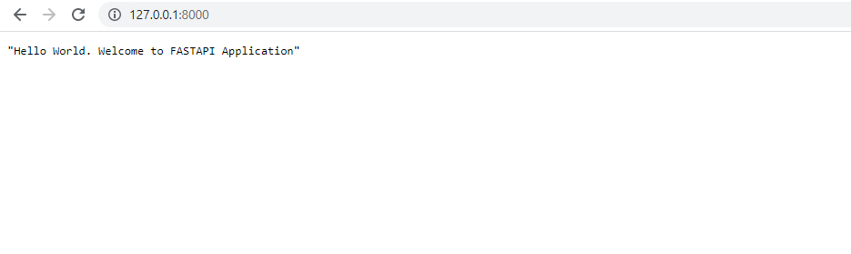

    Fastapi helloworld docker image on the docker hub.

    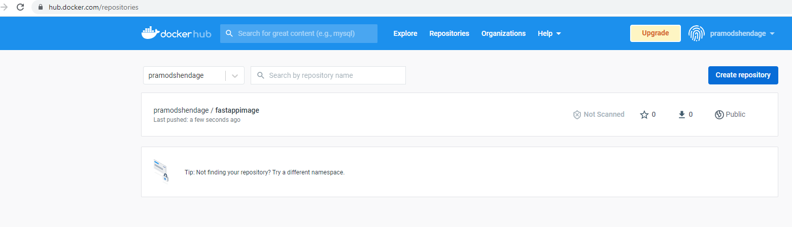
